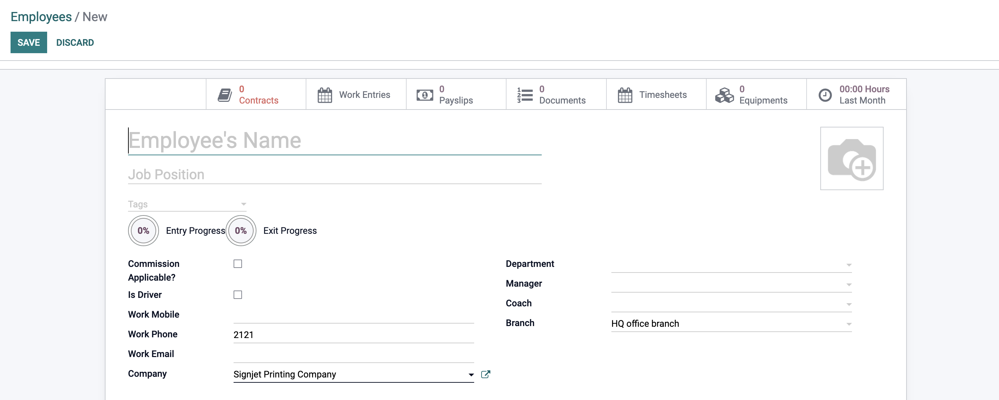

# Commission Introduction

Signjet commission module is a module that allows you to create commissions for your sales team, Designing team, Production team, and other teams that you have in your company.
basically, sales team are the ones who are responsible for creating the commissions, and the other teams they are responsible for completing the commissions according to the sales tasks which will assign to them.

## Commission Types

- **Sales Commission** : Sales team will take the commission after they complete the Printing Sale SO, also they will take a percentage of the total amount of the sale.  
  they will be defferent according to the title of the sales person, and fixed percentage for the sales team.

- **Design Commission** : Design team will take the commission after they complete the Designing task.

### Types of Designing tasks

---

- **_New_** : if the customer wants to create a new design for his product. the sales team will assign the design task to the design team to create a new design, and the design team will take the commission after they complete the design task. according to the category of the product.
- **_Verification_** : if the customer has a design for his product, the sales team will assign the design task to the design team to verify the design, and the design team will take the commission after they complete the verification task. this will be a fixed ammount for the design team.

---

- **Production Commission** : Production team will take the commission after they complete the Printing task.  
  if the product has activity, there will be a Activity Commission for the activity team.

- **Sticker Commission** : Sticker team will take the commission after they complete the Sticker task.

- **Workshop Commission** : Workshop team will take the commission after they complete the Workshop task.

we will explain the commission types in details in the next sections. but first make sure every employee should apliciable for the commission.

to configure that go to the Employee Module, and click on the employee, and check the **Commission Applicable?** make sure it is checked.

<!--  -->

