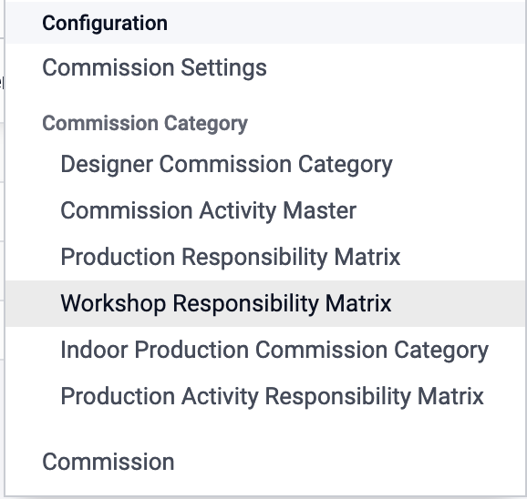

# Design Commission Configuration

Design Commission is a commission that will be taken by the design team after they complete the design task.

## How to Configure Design Commission?

go to the configuration menu, and click on the commission.

then create a Design Commission by clicking on the create button, and fill the fields.

### create design commission

feel the fields as the following:

- **Category Name** : the name of the category.
- **Commission Rate** : the commission rate for the category.
- **Product** : the product that will be applied for the category.
