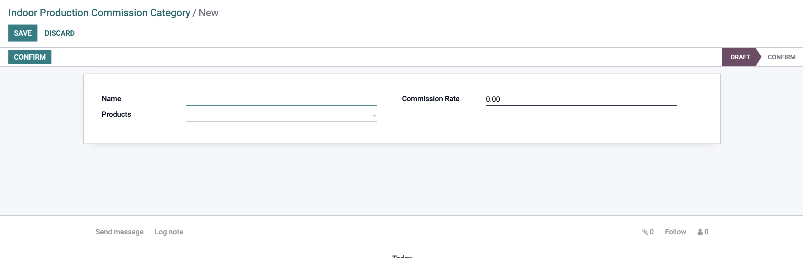

# Production Commission Configuration

Production Commission is a commission that will be taken by the production team after they complete the production task.

## How to Configure Production Commission?

go to the configuration menu, and click on the commission.

<!--  -->

then create a Production Commission by clicking on the create button, and fill the fields.

### create production commission

there are two types of production commission, the first one is the Production Responsibility Matrix and the second one is the Production Activity Responsibility Matrix.

### Production Responsibility Matrix

Production Responsibility Matrix is a commission that will be taken by the production team after they complete the production task.

here is how they will take the commission:

- **Supervisor** : the supervisor will take the commission based on the percentage of the production team.
- **Officer** : the officer will take the commission based on the percentage of the production team.
- **Assistant** : the assistant will take the commission based on the percentage of the production team.

<!--  -->

```Note
-- add the officer, and supervisors in the commission Employee.
```

### Production Activity Responsibility Matrix

Production Activity Responsibility Matrix is a commission that will be taken by the production team after they complete the ativity task.

here is how they will take the commission:

- **Supervisor** : the supervisor will take the commission based on the percentage of the production team.
- **Officer** : the officer will take the commission based on the percentage of the production team.
- **Assistant Commission Percent** : the assistant will take the commission based on the percentage of the production team.

<!--  -->

```Note
-- add the activity officer, and supervisors in the commission Employee.
```

### Production Indhoor Commission

Production Indhoor Commission is a commission that will be taken by the production team after they complete the production task based on Product Category.

### Create Production Indhoor Commission

feel the fields as the following:

- **Category Name** : the name of the category.
- **Commission Rate** : the commission rate for the category.
- **Product** : the product that will be applied for the category.



```Note

```
