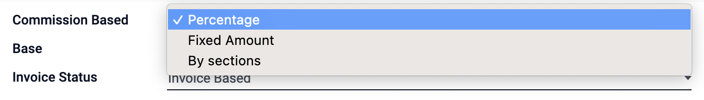
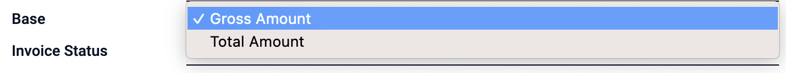
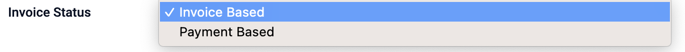

# Sales Configuration

you can configure the sales commission from the configuration.

## How to Configure Sales Commission?

go to the configuration menu, and click on the commission.

<!--  -->

then create a Sales Commission by clicking on the create button, and fill the fields.

### create sales commission

<!--  -->

feel the fields as the following:

- **Name** : the name of the commission.
- **commission based on** : the commission will be based on Fixed Amount or Percentage or selection.
  
- **Base** : the base of the commission will be the total amount of the sale or the gross ammount.
  
- **Invoice Status** : the invoice status will be based on the by payment base or invoice base.
  
- **Commission Type** : the commission type will be based on Product Sale.
  
- **Fixed Percentage & Employee** : give the fixed percentage for the employee.
  
