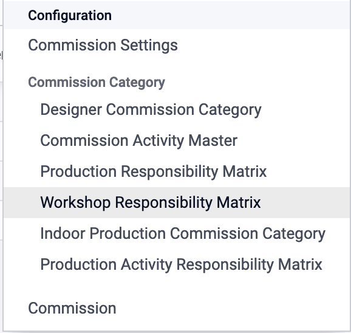
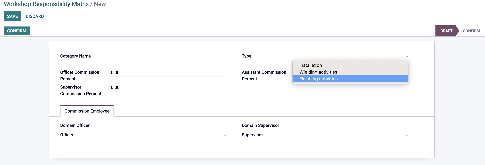

# Workshop Commission

Workshop Commission is a commission that will be taken by the workshop team after they complete the workshop task.

## How to Configure Workshop Commission?

go to the configuration menu, and click on the commission.



then create a Workshop Commission by clicking on the create button, and fill the fields.

### create workshop commission

Create workshop comission responsibility matrix with the following fields:

- **Category Name** : the name of the category.
- **Type** : the type of the commission, there will be three types:
  - **Installation** : the commission will be taken by the installation team.
  - **Welding** : the commission will be taken by the welding team.
  - **Finishing Activity** : the commission will be taken by the finishing team.

```json
// Make create separate commission for each type.
```

- **Officer Commission Percent** : the officer will take the commission based on the percentage of the workshop team.
- **Supervisor Commission Percent** : the supervisor will take the commission based on the percentage of the workshop team.
- **Assistant Commission Percent** : the assistant will take the commission based on the percentage of the workshop team.



```Note
-- add the officer, and supervisors in the commission Employee.
```
